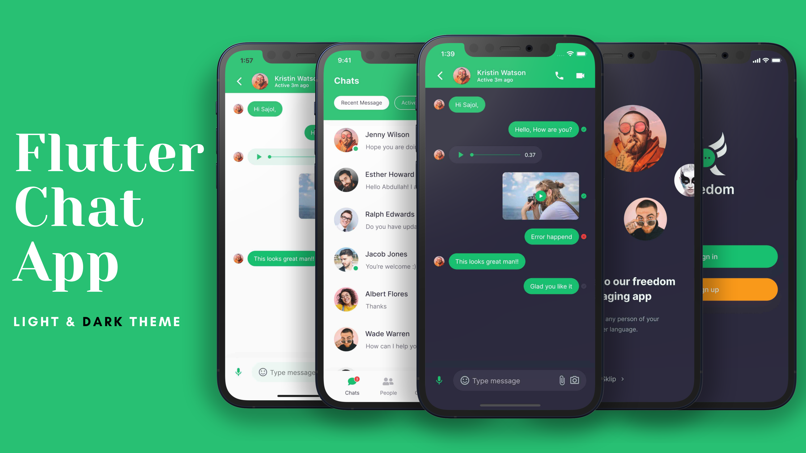

# Chat/Messaging App Light and Dark Theme - Flutter Chat application UI

**Packages we are using:**

Today we gonna build messing/chat app #ui using #flutter that runs both Android and iOS devices also has a dark and light theme. We create in total 4 screens all of that support both Dark Theme and Light Theme. At first, we design a welcome screen that contains an image with a tag line also has a skip button. Once the user press, its transfers to the Sign-in or Sign-up screen. The last two screens are the main screen, Chats screens it shows the list of people you are chated with. At the end message screen which support text message, audio message, and video messages.

### Chat/Messaging App Light and Dark Theme Final UI

